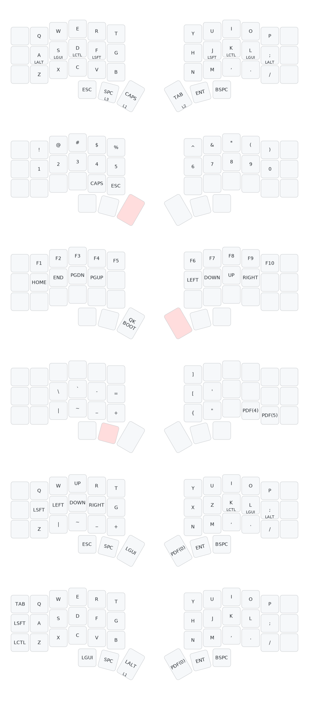

# corne v3 keyboard setup

### build keymap

```sh
qmk compile -kb crkbd/rev1 -km teisho
```

### flash

```sh
qmk flash -kb crkbd/rev1 -km teisho
```

## Draw keymap

install [keymap-drawer](https://github.com/caksoylar/keymap-drawer)

```sh
qmk c2json ./keyboards/crkbd/keymaps/teisho/keymap.c | keymap parse -c 6 -q - > keymap.yaml
keymap draw keymap.yaml > keymap.svg
```

## main layers

1. base
2. numbers & sings
3. movements
4. operators & brackets.

## game layers

5. Touhou
6. Shooters
   
